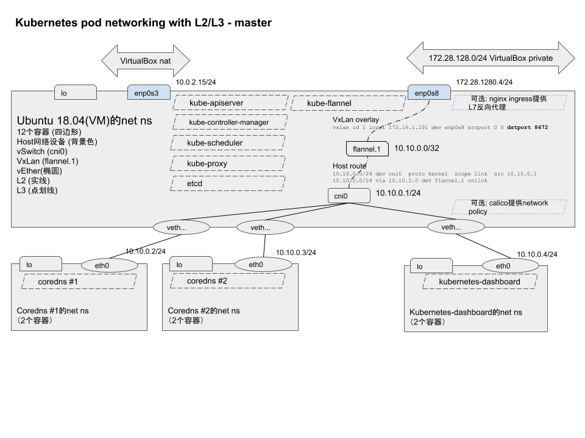

# Kubernetes networking

Table of contents

- Flannel overlay networking
- Calico BGP/IPinIP networking

## Flannel overlay networking

K8s deployment refer to [../k8s-devel-env.md](../k8s-devel-env.md) 

Networking topology 

link to
- https://github.com/moby/moby/issues/20224
- https://forums.docker.com/t/relationship-between-interface-vethxxxxx-and-container/12872
- https://medium.com/@anilkreddyr/kubernetes-with-flannel-understanding-the-networking-part-2-78b53e5364c7
- https://docs.docker.com/v1.7/articles/networking/


### Flannel POD networking in master

Host networking landscape
```
vagrant@ubuntu-bionic:/Users/fanhongling/Downloads/workspace/src/github.com/tangfeixiong/go-to-kubernetes$ sudo ip addr
1: lo: <LOOPBACK,UP,LOWER_UP> mtu 65536 qdisc noqueue state UNKNOWN group default qlen 1000
    link/loopback 00:00:00:00:00:00 brd 00:00:00:00:00:00
    inet 127.0.0.1/8 scope host lo
       valid_lft forever preferred_lft forever
    inet6 ::1/128 scope host 
       valid_lft forever preferred_lft forever
2: enp0s3: <BROADCAST,MULTICAST,UP,LOWER_UP> mtu 1500 qdisc fq_codel state UP group default qlen 1000
    link/ether 02:84:d8:33:f5:88 brd ff:ff:ff:ff:ff:ff
    inet 10.0.2.15/24 brd 10.0.2.255 scope global dynamic enp0s3
       valid_lft 60007sec preferred_lft 60007sec
    inet6 fe80::84:d8ff:fe33:f588/64 scope link 
       valid_lft forever preferred_lft forever
3: enp0s8: <BROADCAST,MULTICAST,UP,LOWER_UP> mtu 1500 qdisc fq_codel state UP group default qlen 1000
    link/ether 08:00:27:e5:e2:33 brd ff:ff:ff:ff:ff:ff
    inet 172.28.128.4/24 brd 172.28.128.255 scope global enp0s8
       valid_lft forever preferred_lft forever
    inet6 fe80::a00:27ff:fee5:e233/64 scope link 
       valid_lft forever preferred_lft forever
4: docker0: <NO-CARRIER,BROADCAST,MULTICAST,UP> mtu 1500 qdisc noqueue state DOWN group default 
    link/ether 02:42:97:e3:c5:af brd ff:ff:ff:ff:ff:ff
    inet 172.17.0.1/16 brd 172.17.255.255 scope global docker0
       valid_lft forever preferred_lft forever
5: br-e65c6afeff2f: <NO-CARRIER,BROADCAST,MULTICAST,UP> mtu 1500 qdisc noqueue state DOWN group default 
    link/ether 02:42:2f:3e:05:2c brd ff:ff:ff:ff:ff:ff
    inet 172.29.0.1/24 brd 172.29.0.255 scope global br-e65c6afeff2f
       valid_lft forever preferred_lft forever
6: flannel.1: <BROADCAST,MULTICAST,UP,LOWER_UP> mtu 1450 qdisc noqueue state UNKNOWN group default 
    link/ether 0a:8e:04:d9:0c:27 brd ff:ff:ff:ff:ff:ff
    inet 10.10.0.0/32 scope global flannel.1
       valid_lft forever preferred_lft forever
    inet6 fe80::88e:4ff:fed9:c27/64 scope link 
       valid_lft forever preferred_lft forever
7: cni0: <BROADCAST,MULTICAST,UP,LOWER_UP> mtu 1450 qdisc noqueue state UP group default qlen 1000
    link/ether 62:cb:e6:c6:82:fb brd ff:ff:ff:ff:ff:ff
    inet 10.10.0.1/24 scope global cni0
       valid_lft forever preferred_lft forever
    inet6 fe80::60cb:e6ff:fec6:82fb/64 scope link 
       valid_lft forever preferred_lft forever
8: veth8214594a@if3: <BROADCAST,MULTICAST,UP,LOWER_UP> mtu 1450 qdisc noqueue master cni0 state UP group default 
    link/ether 92:c3:8e:54:7d:64 brd ff:ff:ff:ff:ff:ff link-netnsid 0
    inet6 fe80::90c3:8eff:fe54:7d64/64 scope link 
       valid_lft forever preferred_lft forever
10: veth2c65dd67@if3: <BROADCAST,MULTICAST,UP,LOWER_UP> mtu 1450 qdisc noqueue master cni0 state UP group default 
    link/ether 9a:13:12:ef:14:3b brd ff:ff:ff:ff:ff:ff link-netnsid 2
    inet6 fe80::9813:12ff:feef:143b/64 scope link 
       valid_lft forever preferred_lft forever
```

__L2__

vSwitch
```
vagrant@ubuntu-bionic:/Users/fanhongling/Downloads/workspace/src/github.com/tangfeixiong/go-to-kubernetes$ brctl show cni0
bridge name	bridge id		STP enabled	interfaces
cni0		8000.62cbe6c682fb	no		veth2c65dd67
							veth8214594a
```

and
```
vagrant@ubuntu-bionic:/Users/fanhongling/Downloads/workspace/src/github.com/tangfeixiong/go-to-kubernetes$ sudo ip -d link show cni0
7: cni0: <BROADCAST,MULTICAST,UP,LOWER_UP> mtu 1450 qdisc noqueue state UP mode DEFAULT group default qlen 1000
    link/ether 62:cb:e6:c6:82:fb brd ff:ff:ff:ff:ff:ff promiscuity 0 
    bridge forward_delay 1500 hello_time 200 max_age 2000 ageing_time 30000 stp_state 0 priority 32768 vlan_filtering 0 vlan_protocol 802.1Q bridge_id 8000.62:cb:e6:c6:82:fb designated_root 8000.62:cb:e6:c6:82:fb root_port 0 root_path_cost 0 topology_change 0 topology_change_detected 0 hello_timer    0.00 tcn_timer    0.00 topology_change_timer    0.00 gc_timer  258.12 vlan_default_pvid 1 vlan_stats_enabled 0 group_fwd_mask 0 group_address 01:80:c2:00:00:00 mcast_snooping 1 mcast_router 1 mcast_query_use_ifaddr 0 mcast_querier 0 mcast_hash_elasticity 4 mcast_hash_max 512 mcast_last_member_count 2 mcast_startup_query_count 2 mcast_last_member_interval 100 mcast_membership_interval 26000 mcast_querier_interval 25500 mcast_query_interval 12500 mcast_query_response_interval 1000 mcast_startup_query_interval 3124 mcast_stats_enabled 0 mcast_igmp_version 2 mcast_mld_version 1 nf_call_iptables 0 nf_call_ip6tables 0 nf_call_arptables 0 addrgenmode eui64 numtxqueues 1 numrxqueues 1 gso_max_size 65536 gso_max_segs 65535 
```

vEther belongs to vSwitch (master = cni0), for example
```
vagrant@ubuntu-bionic:/Users/fanhongling/Downloads/workspace/src/github.com/tangfeixiong/go-to-kubernetes$ ip -d link show veth2c65dd67
10: veth2c65dd67@if3: <BROADCAST,MULTICAST,UP,LOWER_UP> mtu 1450 qdisc noqueue master cni0 state UP mode DEFAULT group default 
    link/ether 9a:13:12:ef:14:3b brd ff:ff:ff:ff:ff:ff link-netnsid 2 promiscuity 1 
    veth 
    bridge_slave state forwarding priority 32 cost 2 hairpin on guard off root_block off fastleave off learning on flood on port_id 0x8003 port_no 0x3 designated_port 32771 designated_cost 0 designated_bridge 8000.62:cb:e6:c6:82:fb designated_root 8000.62:cb:e6:c6:82:fb hold_timer    0.00 message_age_timer    0.00 forward_delay_timer    0.00 topology_change_ack 0 config_pending 0 proxy_arp off proxy_arp_wifi off mcast_router 1 mcast_fast_leave off mcast_flood on neigh_suppress off group_fwd_mask 0x0 group_fwd_mask_str 0x0 vlan_tunnel off addrgenmode eui64 numtxqueues 1 numrxqueues 1 gso_max_size 65536 gso_max_segs 65535 
```

vEther peer of Docker container
```
vagrant@ubuntu-bionic:/Users/fanhongling/Downloads/workspace/src/github.com/tangfeixiong/go-to-kubernetes$ docker ps --format='table {{.Names}}'
NAMES
k8s_coredns_coredns-6955765f44-8n5f6_kube-system_32e64fea-ddd0-4bac-87a1-0993383b7b2b_18
k8s_POD_coredns-6955765f44-8n5f6_kube-system_32e64fea-ddd0-4bac-87a1-0993383b7b2b_71
k8s_coredns_coredns-6955765f44-jsz85_kube-system_6580978a-6636-41c1-9528-a95bc0a29977_18
k8s_POD_coredns-6955765f44-jsz85_kube-system_6580978a-6636-41c1-9528-a95bc0a29977_72
k8s_kube-proxy_kube-proxy-ptzp4_kube-system_3a92ab60-828c-438b-a32e-f33b906bbef7_18
k8s_POD_kube-proxy-ptzp4_kube-system_3a92ab60-828c-438b-a32e-f33b906bbef7_18
k8s_etcd_etcd-ubuntu-bionic_kube-system_78eda4538343f1df8985e0070293c249_18
k8s_kube-controller-manager_kube-controller-manager-ubuntu-bionic_kube-system_c0253caa71b6858f1678bf640d2e5f61_18
k8s_kube-apiserver_kube-apiserver-ubuntu-bionic_kube-system_290b856c245d69da9c17c6c4ddfbb2ad_18
k8s_kube-scheduler_kube-scheduler-ubuntu-bionic_kube-system_9c994ea62a2d8d6f1bb7498f10aa6fcf_18
k8s_POD_etcd-ubuntu-bionic_kube-system_78eda4538343f1df8985e0070293c249_18
k8s_POD_kube-apiserver-ubuntu-bionic_kube-system_290b856c245d69da9c17c6c4ddfbb2ad_18
k8s_POD_kube-scheduler-ubuntu-bionic_kube-system_9c994ea62a2d8d6f1bb7498f10aa6fcf_18
k8s_POD_kube-controller-manager-ubuntu-bionic_kube-system_c0253caa71b6858f1678bf640d2e5f61_18
```

then show POD coredns
```
vagrant@ubuntu-bionic:/Users/fanhongling/Downloads/workspace/src/github.com/tangfeixiong/go-to-kubernetes$ docker inspect k8s_POD_coredns-6955765f44-8n5f6_kube-system_32e64fea-ddd0-4bac-87a1-0993383b7b2b_71 --format='{{.NetworkSettings.SandboxKey}}'
/var/run/docker/netns/87cf83e9642d
```

peer to host net ns (A.K.A veth2c65dd67)
```
vagrant@ubuntu-bionic:/Users/fanhongling/Downloads/workspace/src/github.com/tangfeixiong/go-to-kubernetes$ sudo nsenter --net=/var/run/docker/netns/87cf83e9642d ethtool -S eth0
NIC statistics:
     peer_ifindex: 10
```

__L3__

node subnet
```
vagrant@ubuntu-bionic:/Users/fanhongling/Downloads/workspace/src/github.com/tangfeixiong/go-to-kubernetes$ cat /var/run/flannel/subnet.env 
FLANNEL_NETWORK=10.10.0.0/24
FLANNEL_SUBNET=10.10.0.1/24
FLANNEL_MTU=1450
FLANNEL_IPMASQ=true
```

show in container net namespace
```
vagrant@ubuntu-bionic:/Users/fanhongling/Downloads/workspace/src/github.com/tangfeixiong/go-to-kubernetes$ sudo nsenter --net=/var/run/docker/netns/87cf83e9642d ip addr show eth0
3: eth0@if10: <BROADCAST,MULTICAST,UP,LOWER_UP> mtu 1450 qdisc noqueue state UP group default 
    link/ether 26:09:5b:66:e6:5b brd ff:ff:ff:ff:ff:ff link-netnsid 0
    inet 10.10.0.58/24 scope global eth0
       valid_lft forever preferred_lft forever
```

packets investigation, then open another terminal to exec `vagrant@ubuntu-bionic:~$ ping -c3 10.10.0.58`
```
vagrant@ubuntu-bionic:/Users/fanhongling/Downloads/workspace/src/github.com/tangfeixiong/go-to-kubernetes$ sudo tcpdump -vv -ni veth2c65dd67 icmp
tcpdump: listening on veth2c65dd67, link-type EN10MB (Ethernet), capture size 262144 bytes
18:04:11.291152 IP (tos 0x0, ttl 64, id 25354, offset 0, flags [DF], proto ICMP (1), length 84)
    10.10.0.1 > 10.10.0.58: ICMP echo request, id 32233, seq 1, length 64
18:04:11.291174 IP (tos 0x0, ttl 64, id 65387, offset 0, flags [none], proto ICMP (1), length 84)
    10.10.0.58 > 10.10.0.1: ICMP echo reply, id 32233, seq 1, length 64
18:04:12.294187 IP (tos 0x0, ttl 64, id 25524, offset 0, flags [DF], proto ICMP (1), length 84)
    10.10.0.1 > 10.10.0.58: ICMP echo request, id 32233, seq 2, length 64
18:04:12.294229 IP (tos 0x0, ttl 64, id 35, offset 0, flags [none], proto ICMP (1), length 84)
    10.10.0.58 > 10.10.0.1: ICMP echo reply, id 32233, seq 2, length 64
18:04:13.318450 IP (tos 0x0, ttl 64, id 25556, offset 0, flags [DF], proto ICMP (1), length 84)
    10.10.0.1 > 10.10.0.58: ICMP echo request, id 32233, seq 3, length 64
18:04:13.318491 IP (tos 0x0, ttl 64, id 172, offset 0, flags [none], proto ICMP (1), length 84)
    10.10.0.58 > 10.10.0.1: ICMP echo reply, id 32233, seq 3, length 64
^C
6 packets captured
6 packets received by filter
0 packets dropped by kernel
```

### Cluster networking

Host route
```
vagrant@ubuntu-bionic:/Users/fanhongling/Downloads/workspace/src/github.com/tangfeixiong/go-to-kubernetes$ ip r
default via 10.0.2.2 dev enp0s3 proto dhcp src 10.0.2.15 metric 100 
10.0.2.0/24 dev enp0s3 proto kernel scope link src 10.0.2.15 
10.0.2.2 dev enp0s3 proto dhcp scope link src 10.0.2.15 metric 100 
10.10.0.0/24 dev cni0 proto kernel scope link src 10.10.0.1 
10.10.2.0/24 via 10.10.2.0 dev flannel.1 onlink 
172.17.0.0/16 dev docker0 proto kernel scope link src 172.17.0.1 linkdown 
172.28.128.0/24 dev enp0s8 proto kernel scope link src 172.28.128.4 
172.29.0.0/24 dev br-e65c6afeff2f proto kernel scope link src 172.29.0.1 linkdown 
```

__LAN local__

Packets to/from LAN (AKA 10.10.0.0/24), for example 
```
vagrant@ubuntu-bionic:/Users/fanhongling/Downloads/workspace/src/github.com/tangfeixiong/go-to-kubernetes$ ip route get 10.10.0.58
10.10.0.58 dev cni0 src 10.10.0.1 uid 1000 
    cache 
```

Then via ARP to retrieve dest ether MAC
```
vagrant@ubuntu-bionic:/Users/fanhongling/Downloads/workspace/src/github.com/tangfeixiong/go-to-kubernetes$ ip neigh show dev cni0
10.10.0.56 lladdr 42:3a:b8:b1:f9:2e REACHABLE
10.10.0.57 lladdr e2:1a:e1:35:03:2a STALE
10.10.0.58 lladdr 26:09:5b:66:e6:5b REACHABLE
10.10.0.59 lladdr a6:03:64:53:5e:ba STALE
```

Last, packets transform into ethernet frame
- https://support.huawei.com/enterprise/en/doc/EDOC1100088104
- https://www.networkkings.org/ethernet-frame-formats/
- https://en.wikipedia.org/wiki/Ethernet_frame
- https://medium.com/@mdlayher/network-protocol-breakdown-ethernet-and-go-de985d726cc1)

__overlay__

Packets to/from another node (AKA 10.10.0.0/16 except 10.10.0.0/24)

via host route, packets delivery to flannel.1
```
vagrant@ubuntu-bionic:/Users/fanhongling/Downloads/workspace/src/github.com/tangfeixiong/go-to-kubernetes$ ip -d link show flannel.1
6: flannel.1: <BROADCAST,MULTICAST,UP,LOWER_UP> mtu 1450 qdisc noqueue state UNKNOWN mode DEFAULT group default 
    link/ether 0a:8e:04:d9:0c:27 brd ff:ff:ff:ff:ff:ff promiscuity 0 
    vxlan id 1 local 172.28.128.4 dev enp0s8 srcport 0 0 dstport 8472 nolearning ttl inherit ageing 300 udpcsum noudp6zerocsumtx noudp6zerocsumrx addrgenmode eui64 numtxqueues 1 numrxqueues 1 gso_max_size 65536 gso_max_segs 65535 
```

VxLan overlay (e.g. switch L2 flat/vlan frame via L4 UDP packets, the upon shows dstport=8472)
```
vagrant@ubuntu-bionic:/Users/fanhongling/Downloads/workspace/src/github.com/tangfeixiong/go-to-kubernetes$ netstat -upnl 
(Not all processes could be identified, non-owned process info
 will not be shown, you would have to be root to see it all.)
Active Internet connections (only servers)
Proto Recv-Q Send-Q Local Address           Foreign Address         State       PID/Program name    
udp        0      0 127.0.0.53:53           0.0.0.0:*                           -                   
udp        0      0 0.0.0.0:68              0.0.0.0:*                           -                   
udp        0      0 10.0.2.15:68            0.0.0.0:*                           -                   
udp        0      0 0.0.0.0:8472            0.0.0.0:*                           -                   
```

look up VxLan peer dest via ARP 
```
root@worker01:~# ip neigh show 10.10.2.0
10.10.2.0 dev flannel.1 lladdr 06:f5:5b:c5:a4:c9 PERMANENT
```

look up VxLan peer dest via Forward DB
```
root@worker01:~# bridge fdb show | grep 06:f5:5b:c5:a4:c9
06:f5:5b:c5:a4:c9 dev flannel.1 dst 172.28.128.102 self permanent
```

Last, data encapsulated and transfer to/from 

VxLan packets
- https://forum.huawei.com/enterprise/en/vxlan-packet-format/thread/484303-861
- https://datacenteroverlords.com/category/overlay/

### Flannel IPAM

TBC

## Calico BGP/IPinIP networking

K8s deployment refer to [./k8s-1.17-deploy-hands-on/](./k8s-1.17-deploy-hands-on/) 

Networking topology (TBC)

link to
- http://www.dasblinkenlichten.com/getting-started-with-calico-on-kubernetes/
- https://medium.com/flant-com/calico-for-kubernetes-networking-792b41e19d69

## POD network policy

TBC

## Service Virtual Addresses

TBC

## Load Balancer

### Proxy via node port 

TBC

__OpenStack Neutron__

__Nginx Keepalived__

__Haproxy Keepalived__

__LVM Keepalived__

### Nginx L7 reverse proxy via Ingress

TBC

__Modsecurity modules__

TBC