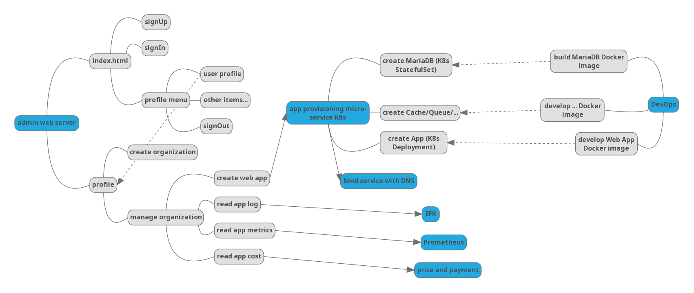

# Common SaaS Admin Architect

Mind map

## Use Case

### 用户和组织机构管理模块

1. 登录成为SaaS用户
1. SaaS用户所管理的网上机构

### 管理SaaS app

__在用户的组织中心页上去创建应用系统__

1. 例如一个题目和考试系统的应用， 是Docker容器形态
1. 在Kubernetes上完成应用组件的部署， 例如数据库， api， web
1. 配置服务访问
    例如在ali云， [aliyun networking api doc](https://help.aliyun.com/document_detail/25544.html?spm=a2c4g.11186623.6.992.lBaE02)  [api repository](https://github.com/aliyun/alibaba-cloud-sdk-go)
1. 配置DNS
    例如在ali云， [sdk](https://github.com/denverdino/aliyungo)
    
__资费管理__

1. 根据所使用的资源(CPU， 内存， 磁盘)
1. 结合公有云厂商的基础价格
1. 应用的服务报价
1. 租赁的期限等

__应用管理__

1. 用户是SaaS应用管理者， 可管理应用的日志。 用EFK（Elastic Fluentd， Kibana）的api
1. 管理应用的度量， 查看应用的cpu利用率， 内存使用量， 磁盘使用量等等 用Prometheus API
    

### 关于

__SaaS应用市场__

1. 为一个应用做SaaS，与多个应用的SaaS没有区别， 只需额外增加一个应用商店
1. 类比手机上的应用商店
